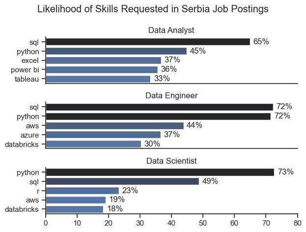
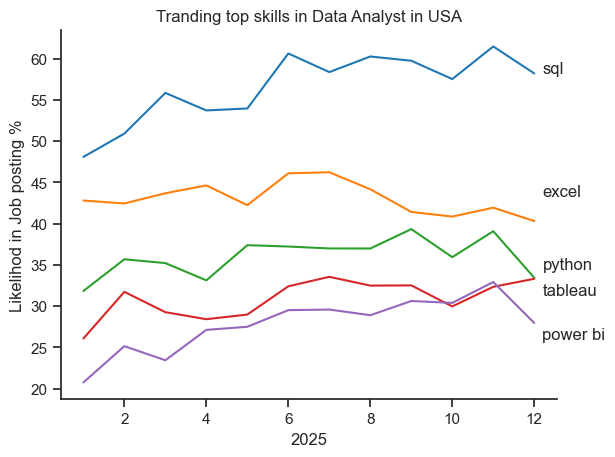
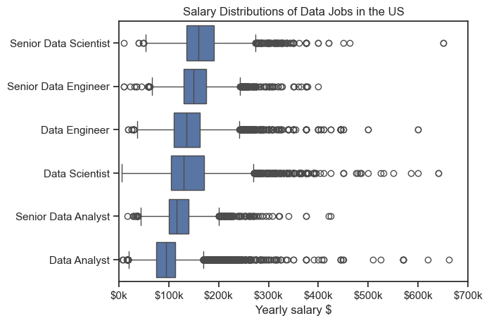
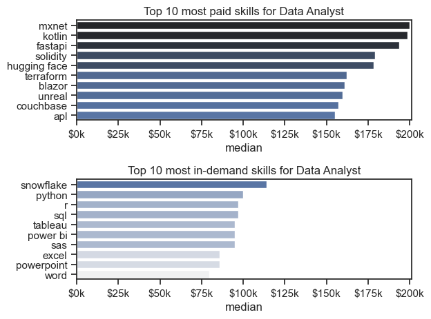

# Overview

Welcome to my analysis of the data job market, focusing on data analyst roles. This project was created out of a desire to navigate and understand the job market more effectively. It delves into the top-paying and in-demand skills to help find optimal job opportunities for data analysts.

The data sourced from [Luke Barousse's Python Course](https://lukebarousse.com/python) which provides a foundation for my analysis, containing detailed information on job titles, salaries, locations, and essential skills. Through a series of Python scripts, I explore key questions such as the most demanded skills, salary trends, and the intersection of demand and salary in data analytics.

# The Questions

Below are the questions I aim to answer in this project. Depending on data availability, some analyses focus on Serbia, while others use data for the United States. The geographical scope will be clearly indicated for each question.

1. What are the skills most in demand for the top 3 most popular data roles?
2. How are in-demand skills trending for Data Analysts?
3. How well do jobs and skills pay for Data Analysts?
4. What are the optimal skills for data analysts to learn? (High Demand AND High Paying) 

# Tools I Used

For my deep dive into the data analyst job market, I harnessed the power of several key tools:

- **Python:** The backbone of my analysis, allowing me to analyze the data and find critical insights.I also used the following Python libraries:
    - **Pandas Library:** This was used to analyze the data. 
    - **Matplotlib Library:** I visualized the data.
    - **Seaborn Library:** Helped me create more advanced visuals. 
- **Jupyter Notebooks:** The tool I used to run my Python scripts which let me easily include my notes and analysis.
- **Visual Studio Code:** My go-to for executing my Python scripts.
- **Git & GitHub:** Essential for version control and sharing my Python code and analysis, ensuring collaboration and project tracking.

## Import & Clean Up Data

I start by importing necessary libraries and loading the dataset, followed by initial data cleaning tasks to ensure data quality.

```python
# Importing Libraries
import ast
import pandas as pd
import seaborn as sns
from datasets import load_dataset
import matplotlib.pyplot as plt  

# Loading Data - only data for 2023
# dataset = load_dataset('lukebarousse/data_jobs')
# df = dataset['train'].to_pandas()

# Loading Data - 2023, 2024, 2025 and first half of 2026:
df = pd.read_csv(r"C:\Users\Nikola S\Desktop\Luke B\job_postings_flat.csv")

# Data Cleanup
df['job_posted_date'] = pd.to_datetime(df['job_posted_date'])
df['job_skills'] = df['job_skills'].apply(lambda x: ast.literal_eval(x) if pd.notna(x) else x)
```

## Filter Jobs by Country

Depending on the question and data availability, the analysis focuses either on the Serbian or the U.S. job market. The relevant country filter is applied accordingly and clearly indicated in each analysis.

### United States

```python
df_US = df[df['job_country'] == 'United States']

df_Serbia = df[df['job_country'] == 'Serbia']
```

# The Analysis
## 1. What are the most demanded skills for the top 3 most popular data roles?

To find the most demanded skills for the top 3 most popular data roles. I filtered out those positions by which ones were the most popular, and got the top 5 skills for these top 3 roles. This query highlights the most popular job titles and their top skills, showing which skills I should pay attention to depending on the role I'm targeting. 

View my notebook with detailed steps here: [2_skill_demand](./2_skill_demand.ipynb).

### Visualize Data

```python
fig, ax = plt.subplots(len(job_titles),1)
sns.set_theme(style="ticks")

for i, job_title in enumerate(job_titles):
    df_plot = df_skills_perc[df_skills_perc["job_title_short"] == job_title].head(5)
    sns.barplot(data=df_plot, x="skill_perc", y="job_skills", ax=ax[i],  hue="skill_perc", palette="dark:b_r")
    # df_plot.plot(kind="barh", x="job_skills", y="skill_perc", ax=ax[i], title = job_title)
    #ax[i].invert_yaxis()
    ax[i].set_ylabel("")
    ax[i].set_title(job_title)
    ax[i].legend().set_visible(False)
    ax[i].set_xlim(0,80)
    ax[i].set_xlabel("")
    sns.despine(ax=ax[i])

    for n,v in enumerate(df_plot["skill_perc"]):
        ax[i].text(v+1, n, f"{v:.0f}%", va="center")
    if i != len(job_titles)-1:
        ax[i].set_xticks([])

fig.suptitle("Likelihood of Skills Requested in Serbia Job Postings")
fig.tight_layout()
plt.show()
```

### Results




### Insights

- **SQL and Python are the most important skills across data roles**, appearing among the top two skills for Data Analysts, Data Engineers, and Data Scientists.
- **Data Analysts** show a more balanced skill set, with SQL (65%) and Python (45%) leading, followed by Excel (37%), Power BI (36%), and Tableau (33%).
- **Data Engineers** have the strongest demand for both SQL and Python (72%), while cloud and big-data technologies such as AWS, Azure, and Databricks also play an important role.
- **Data Scientists** are particularly Python-oriented, with Python appearing in 73% of job postings, substantially ahead of SQL (49%).
- Overall, the results suggest that **Python and SQL provide the strongest foundation for working across different data careers in Serbia**, while role-specific tools become increasingly important depending on the career path.

## 2. How are in-demand skills trending for Data Analysts?

To find how skills are trending in 2025 for Data Analysts, I filtered data analyst positions and grouped the skills by the month of the job postings. This got me the top 5 skills of data analysts by month, showing how popular skills were throughout 2025.

View my notebook with detailed steps here: [3_Skills_Trend](3_Skill_trend.ipynb).

### Visualize Data

```python

df_plot = df_DA_USA_perc.iloc[:,:5]

sns.lineplot(data=df_plot, dashes=False, palette="tab10")
sns.set_theme(style="ticks")

plt.title("Tranding top skills in Data Analyst in USA")
plt.ylabel("Likelihod in Job posting %")
plt.xlabel(2025)
sns.despine()

plt.legend().remove()


offsets = [0, 3, 1, -2, -2]
for i in range(5):
   plt.text(12.2, df_plot.iloc[-1, i] + offsets[i], df_plot.columns[i])

```

### Results

*Bar graph visualizing the trending top skills for data analysts in the US in 2025.*

### Insights:
- **SQL remains the most consistently demanded skill throughout the year**, increasing from around 48% in January to nearly 60% by the end of the year, with demand peaking above 60% in several months.
- **Excel is consistently the second most demanded skill**, remaining relatively stable at around 40–46% of job postings throughout the year.
- **Python shows an overall upward trend**, rising from approximately 32% at the beginning of the year and reaching close to 40% in some later months.
- **Tableau also shows a moderate upward trend**, increasing from around 26% in January to above 30% toward the end of the year.
- **Power BI experiences the largest relative increase during the year**, rising from around 20% in January to above 30% in the later months, although it drops noticeably in December.

## 3. How well do jobs and skills pay for Data Analysts?

To identify the highest-paying roles and skills, I only got jobs in the United States and looked at their median salary. But first I looked at the salary distributions of common data jobs like Data Scientist, Data Engineer, and Data Analyst, to get an idea of which jobs are paid the most. 

View my notebook with detailed steps here: [4_salary_analysis](4_salary_analysis.ipynb).

#### Visualize Data 

```python
sns.boxplot(data = df_US_top7, x="salary_year_avg", y="job_title_short", order = job_order)
plt.xlabel("Yearly salary $")
plt.ylabel("")
plt.title("Salary Distributions of Data Jobs in the US")
plt.xlim(0,700000) 
plt.gca().xaxis.set_major_formatter(plt.FuncFormatter(lambda x, pos: f'${int(x/1000)}k'))
plt.show()

```

#### Results

  
*Box plot visualizing the salary distributions for the top 7 data job titles.*

#### Insights


- **Senior Data Scientist positions have the highest typical salaries**, with the highest median salary among the six data roles, followed closely by Senior Data Engineers.

- **Seniority has a clear impact on compensation.** Senior Data Scientists, Data Engineers, and Data Analysts generally have higher median salaries than their corresponding non-senior roles.

- **Data Analyst positions have the lowest median salary and the narrowest typical salary range**, while Data Scientist and Data Engineer roles tend to offer higher compensation.

- **All roles contain high-salary outliers**, with some Data Analyst, Data Scientist, and Data Engineer positions exceeding $500K annually. These extreme values represent exceptional cases rather than typical salaries.

- Overall, the salary distributions suggest that **both specialization and seniority are associated with higher earning potential in the U.S. data job market.**

### Highest Paid & Most Demanded Skills for Data Analysts

Next, I narrowed my analysis and focused only on data analyst roles. I looked at the highest-paid skills and the most in-demand skills. I used two bar charts to showcase these.

#### Visualize Data

```python

fig, ax = plt.subplots(2,1)
sns.set_theme(style="ticks")

sns.barplot(data=df_top_pay, y="job_skills", x="median" , ax=ax[0], hue="median" , palette="dark:b_r")
ax[0].legend().remove()
ax[0].set_title("Top 10 most paid skills for Data Analyst")
ax[0].set_ylabel("")
ax[0].xaxis.set_major_formatter(plt.FuncFormatter(lambda x, pos: f'${int(x/1000)}k'))
ax[0].set_xlim(0,201000)

sns.barplot(data=df_top_skills, y="job_skills", x="median" , ax=ax[1], hue="median" , palette="light:b")
ax[1].legend().remove()
ax[1].set_title("Top 10 most in-demand skills for Data Analyst")
ax[1].set_ylabel("")
ax[1].xaxis.set_major_formatter(plt.FuncFormatter(lambda x, pos: f'${int(x/1000)}k'))
ax[1].set_xlim(0,201000)

fig.tight_layout()

```

#### Results
Here's the breakdown of the highest-paid & most in-demand skills for data analysts in the US:


*Two separate bar graphs visualizing the highest paid skills and most in-demand skills for data analysts in the US.*

#### Insights:

- **The highest-paying skills are mostly specialized technologies.** MXNet and Kotlin have median salaries close to $200K, while FastAPI, Solidity, and Hugging Face are also associated with particularly high salaries.

- **The most in-demand skills are dominated by widely used data analysis tools.** Snowflake, Python, R, SQL, Tableau, and Power BI appear among the most frequently requested skills, highlighting the importance of a broad analytical toolkit.

- Among the most in-demand skills, **Snowflake stands out with the highest median salary**, at roughly $115K, while Python, R, and SQL are around the $95K–$100K range.

- There is a noticeable difference between **high-paying niche skills and commonly demanded skills**. Specialized technologies can be associated with substantially higher salaries, but they may appear in far fewer job postings.

- Overall, the results suggest that Data Analysts can benefit from combining **widely demanded core skills such as SQL, Python, and BI tools with more specialized technologies** that may offer higher salary potential.